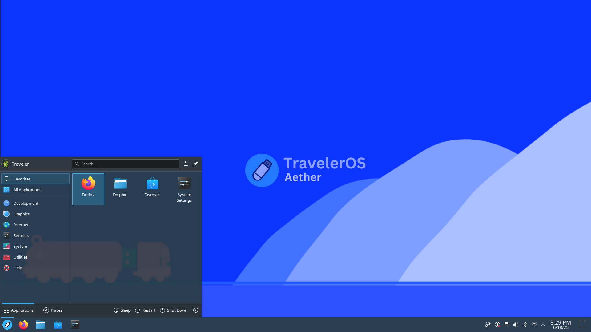

# TravelerOS - A linux distro built for USB drives.

TravelerOS is a lightweight and stable linux distribution based on Q4OS, which is Debian based. It is built for USB drives, and not hard drives. TravelerOS comes with KDE Plasma 5, not 6. TravelerOS is customized to be a portable linux distribution meant for USB drives, although you could boot it from a CD, or SD card, if possible. TravelerOS is also lightweight, only taking up 700 MB of RAM. TravelerOS is also very customizable, thanks to KDE Plasma, with that, you can customize the start menu, the panel, the window, the icons, anything! Since TravelerOS is portable, even if you boot the USB drive in a different computer, it still works the same! TravelerOS is meant for users who want to try/use linux, without installing it to the hard drive, meaning that you can store apps, games, documents, and other stuff without it erasing on reboot. TravelerOS is also meant for users who need help with their hard drive or their current operating system, like fixing the bootloader, partitioning the disk, removing a partition, or erasing the whole disk.

## Installation Guide
For windows computers:
1. Install (or run) Rufus.
2. If you see an option that says **`Persistent partition size`** , then put in a good amount.
   For 32 GB USB's put 20 GB.
3. If you have a USB drive that is less than 32 GB, don't add the persistent partition.
4. Click **`START`**
5. Once done you can either reboot to the USB or eject it.

WARNING: Once you reboot to Windows, the time will change. 

For linux computers:
1. Extract the ISO image to your USB drive. (Format it first!)
2. Once done, you can either reboot to the USB or eject it.

## Notes:
- If TravelerOS is for some reason running slowly, it's because your USB read and write speeds. Or your hardware.
- If your on Rufus, don't just fill up all of it, if you do, you may not be able to fit enough apps.
- For linux computers, if a USB flasher application works well with TravelerOS, please let us know by emailing traveleros44@gmail.com
- If your computer won't boot TravelerOS, please email traveleros44@gmail.com

## Need help?
Head to https://discord.gg/4BxsrrFMjJ .

TravelerOS is a lightweight linux distribution aimed for USB drives.
If you have any questions, feel free to email traveleros44@gmail.com

